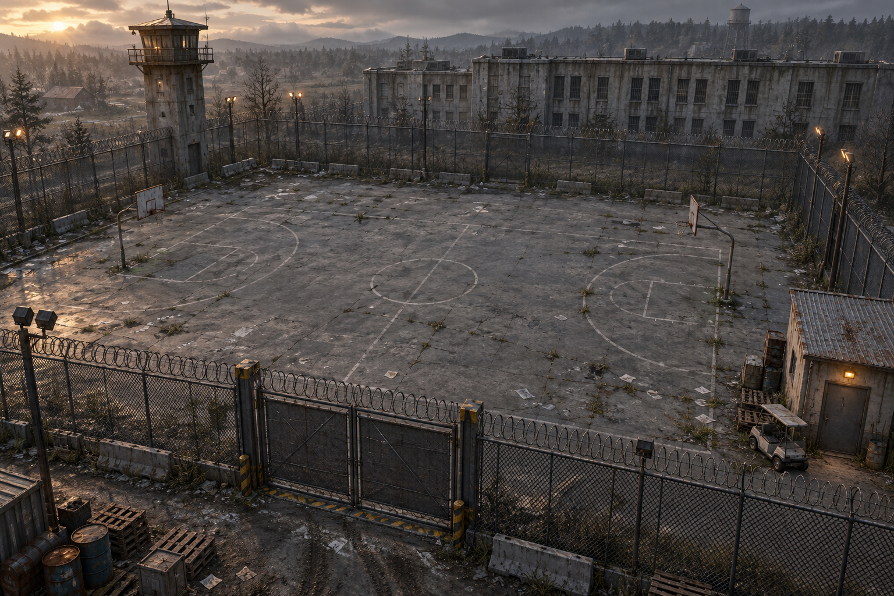

# Days Gone Quiet 🧟‍♂️🌲

A small reinforcement learning survival project built in Unity.

The idea is still simple:

> **Rick learns how to survive.**

This started with one little arena, one Rick, and one Walker.

Now Rick is learning inside **Grayhaven Prison Yard** — a worn-down place with chain-link fences, guard towers, cracked concrete, dead weeds, abandoned yard stuff, and a road leading toward whatever comes next.

This got a lot more real today. 🥹

*The atmosphere we are building toward.*

---

## 🧠 How Rick Learns

Rick is not simply told:

> “If the Walker gets close, run away.”

He observes where he is and where the Walker is, chooses how to move, and learns from what happens next.

- surviving earns a reward
- getting caught earns a penalty
- leaving the yard earns a penalty
- every episode resets Rick and the Walker
- Rick tries again

And again.

And again.

Some attempts look promising.

Some look like Rick completely forgot what a Walker is. 😅

That is part of the experiment.

---

## 🧪 Rick’s Learning Lab

One of my favorite additions is **Rick’s Learning Lab** inside Unity.

My partner and I can change things like:

- Rick’s speed
- the Walker’s speed
- rewards and penalties
- how close the Walker can spawn
- how long each episode lasts
- how often Rick makes a decision
- how fast training runs

That lets us change one thing at a time and see whether it helps or hurts Rick’s learning.

The Learning Lab also has a button that opens the **Days Gone Quiet training dashboard**, where we can watch Rick’s rewards and progress in TensorBoard.

---

## 🎥 Watching the Yard

Open `Assets/Scenes/PrisonYard.unity` and press Play.

The camera has five views:

1. Full Yard
2. Front Gate
3. Courtyard
4. Guard Tower
5. Follow Rick

Press the number keys while the game is running to switch between them.

To see the learning charts, use **Days Gone Quiet → Open Training Dashboard** in Unity. You can also open the dashboard from Rick’s Learning Lab in the Inspector.

> **Tiny but important:** Pressing Play lets Rick use the trained brain already saved in the project. To make him continue learning, the Python ML-Agents trainer needs to be connected before pressing Play.

---

## 🚧 Project Status

Still early. But not nearly as early as it was yesterday.

Current progress:

- [x] Rick is a working reinforcement learning agent
- [x] Walker chase behavior is working
- [x] collisions and episode resets are working
- [x] real PPO training is connected
- [x] first trained Rick brain added
- [x] first visual pass for Rick and the Walker
- [x] Grayhaven Prison Yard built
- [x] prison buildings, fences, guard towers, vegetation, and yard details added
- [x] five camera views added
- [x] Rick’s Learning Lab added
- [x] TensorBoard dashboard launcher added inside Unity
- [ ] keep experimenting with rewards and difficulty
- [ ] teach Rick to reliably survive one Walker
- [ ] add more Walkers
- [ ] add hiding, noise, stamina, supplies, and safe areas
- [ ] improve the characters and animation
- [ ] build roads leading toward other towns
- [ ] make the world bigger, stranger, and more dangerous

---

## 🛠️ Built With

- Unity
- C#
- Unity ML-Agents
- Python
- PyTorch
- PPO reinforcement learning
- TensorBoard

---

## 🌎 Long-Term Vision

The dream is a larger survival world where learning agents have to deal with Walkers, obstacles, resources, other survivors, and choices that become more complicated over time.

The prison yard is the first real location.

Later there can be roads.

Then towns.

Then more Walkers.

Then we see what Rick actually learned.

For now:

**One Rick. 
One Walker. 
One prison yard. 
One neural network with a lot to learn.**

🧟‍♂️

---

*Days Gone Quiet is an independent learning project inspired by zombie-survival stories.*
